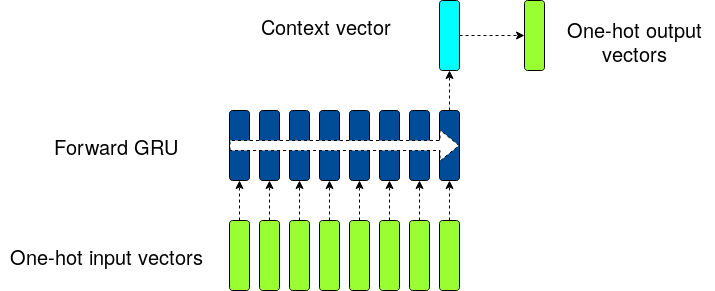
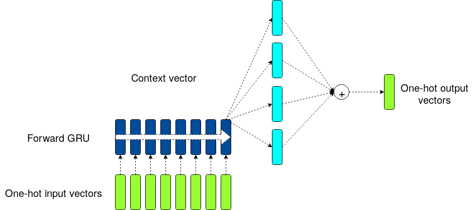

Experiments on Mixture of softmaxes
===================================

In the following I try the Mixture of Softmaxes technique onto an RNN model trained on the Penn Treebank.


Installation
------------

```bash
virtualenv --python=/usr/bin/python3 .env
source .env/bin/activate
pip install -r requirements.txt
```

If you need to install a GPU version
```bash
pip install -r requirements_gpu.txt
```


Running the models
------------------
There are three models: baseline, Mixture of Softmaxes (MOS), and Mixture of Contexts (MOC)

In order to train them (it takes many hours on a GPU)
```bash
python -m mixture_of_softmax.train_baseline
python -m mixture_of_softmax.train_mos
python -m mixture_of_softmax.train_moc
```

In order to compute and print the validation set results (it takes a few tens of minutes)
```bash
python -m mixture_of_softmax.validate_baseline
python -m mixture_of_softmax.validate_mos
python -m mixture_of_softmax.validate_moc
```

In order to compute and print the test set results on the best epoch in validation (it takes a few minutes)
```bash
python -m mixture_of_softmax.test_baseline
python -m mixture_of_softmax.test_mos
python -m mixture_of_softmax.test_moc
```


Network structure
------------------------------
The baseline network structure is as in Fig. 1

{height=50%}

whereas the MOS and MOC models are depicted in Fig.2

{height=50%}

I implemented the network described in [[Tying Word Vectors and Word Classifiers](https://arxiv.org/pdf/1611.01462.pdf)].
The text is tokenized into words. A set of contiguous 35 words is fed as an input to the RNN and the 36th word is
the desired output of the network.
The baseline network follows the equations

```math
x_t = W y_{t-1}
h_t = f(x_t, h_{t-1})
z_t = softmax(W^\intercal h_t)
```
where f() is the GRU function, the y1, y2, ... are one-hot encodings of the words, x1, x2,... are the low dimensional
embeddings for the words, h_t are the hidden states of the RNN, and W is the matrix that transforms one-hot encodings
into word embeddings (and vice-versa  with the transpose of W)

The outputs z_t are to be compared to the one-hot encodings of the 36th word.

I did not use any dropout in these models

|Layer | dimension  |
|------|:----------:|
|Word embeddings     | 300 |
|GRU memory     | 900 |
|GRU stacks     | 2 |
|Minibatch size    | 20 |
|BPTT    | 35 |
|MOS and MOC ensemble size | 15 |


Training and evaluation
-----------------------

I used the Penn Treebank Corpus for training and evaluation: Due to time constraints the training is done on 500k
samples from the training set of the PTC. Each sample is composed by 35 + 1 contiguous words.

The loss function used for training is the cross entropy
```math
L = sum z^* log(z)
```
where z is the network prediction and z^* is the correct label.

The models are evaluated by measuring the network's perplexity, i.e. the exponential of the loss
averaged on all the testing samples.

Following [[Breaking the Softmax Bottleneck](https://arxiv.org/pdf/1711.03953.pdf)] I trained three different models:
The baseline model (as described before), the Mixture of Softmaxes model (MOS) and the Mixture of Contexts model (MOC).

The MOS model is effectively an ensemble method with attention: the hidden state that comes out of the RNN is dispatched into
15 different vectors by using 15 different projections matrices, each one with different initial random conditions.
These 15 different vectors are then multiplied with the matrix W^\intercal creating 15 different logit vectors.
Each of these logit vectors are then passed through a softmax function, provinding 15 different probability distributions for the next word.
These probability distributions are then summed together using relevant attention coefficients. 
The MOS model is supposed to provide a better generalization.

The MOC model is still an attention model, but it is not an ensemble technique any more, because the 15 different logit vectors
are summed together before the softmax function.
Moreover, the attention coefficients do not provide any additional generalisation upon the baseline:
Generalization comes from compression; as shown in the paper, the 15 logits vectors summed together can be mapped to a single logit vector and therefore have the same information.
The MOC model is expected to perform as the baseline model.

I have tried to reproduce the results in the literature. The main difference between these models and the ones in
[[Breaking the Softmax Bottleneck](https://arxiv.org/pdf/1711.03953.pdf)] is the pre-sampling of the Penn Treebank Corpus.
I only used half a million elements of the PTC (from ~4 million). As a result, the network has less data to learn and
generalise from.


Results and conclusions
-----------------------

The best results are in the following table. Lowest perplexity is best.

| Model | VALID loss | VALID Perplexity| TEST LOSS | TEST Perplexity | Training Epoch |
|:---------:|:--------:|:---:|:----:|:---:|:---:|
|Baseline | 6.8578 | 951.33 | 6.7887 | 887.77 | 11 |
|MOS      | 6.8166 | 912.92 | 6.7398 | 845.41 |  8 |
|MOC      | 6.8599 | 953.31 | 6.7755 | 876.16 | 11 |


While I was not able to reproduce the exact results of
[[Breaking the Softmax Bottleneck](https://arxiv.org/pdf/1711.03953.pdf)]
in a few days of work, the main conclusions of the paper seem effectively confirmed:
The MOS model is seen generalising better than the baseline, while the MOC model is closer to the baseline
than the MOS model.

It is worth noticing that the difference in the code between MOC and MOS is effectively only the
position of the softmax in line 54 of the respective models:

In mos_model.py the outputs are computed using the first equation in chapter 2.4 of [[Breaking the Softmax Bottleneck](https://arxiv.org/pdf/1711.03953.pdf)]
```python
tf.reduce_sum(tf.multiply(tf.nn.softmax(self.hw_matrix), self.pi_values), axis=0)
```
whereas in moc_model.py the outputs are computed using Eq. 2 of [[Breaking the Softmax Bottleneck](https://arxiv.org/pdf/1711.03953.pdf)]
```python
tf.nn.softmax(tf.reduce_sum(tf.multiply(self.hw_matrix, self.pi_values), axis=0))
```
This only change is the cause of about 4% performance difference.


Finally, the poor results in terms of perplexity seem to have two causes: The pre-sampling of the training
dataset, which implies less data to learn from, and the relatively low GRU memory, which seems to bring
the training onto a local minimum. A bit more computational effort is needed to reproduce the results
of the cited papers.


